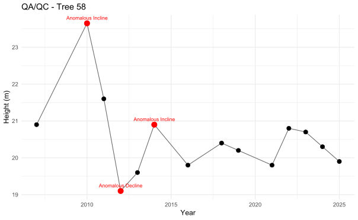
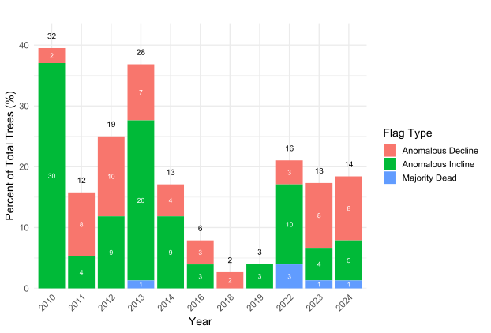
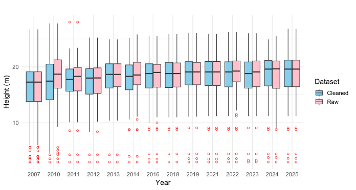
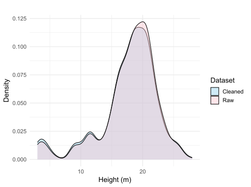
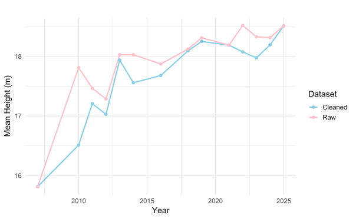
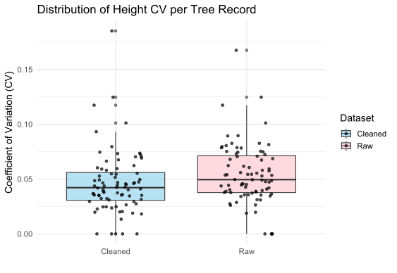

We explored removing data from tree height observations based on directional and magnitude-based flag rules described below for Ponderosa Pines above 3m at the PPine site circle plots in order to improve the overall quality of the dataset.

## Flagging Rules

To evaluate the reliability of annual tree height measurements, we applied a three-point growth increment check to individual trees' height time series. For three consecutive observations (not necessarily consecutive years), we calculated the associated height growth increments and classified them according to their magnitude and direction:

-   **Pos:** increase in height greater than 0.4 m

-   **Pos_Stag:** increase in height at or below 0.4 m


```{=html}
<!-- -->
```


-   **Neg:** decrease in height less than -0.4 m


```{=html}
<!-- -->
```


-    **Neg_Stag:** decrease in height at or above -0.4 m

Once the growth increments were classified using the above thresholds, we determined if the center point in the three-point window should be flagged. If the first point in the three-point window was already flagged, we use the point preceding as point one instead. To summarize, the center point only has the potential to be flagged if the sign of the growth increment (positive to negative or negative to positive) and the magnitude of both is substantial (\>0.4m). Thus, out of all the combinations of the above increment types, only Pos --\>Neg and Neg--\>Pos have the potential to be flagged as the following:

-   **Anomalous Incline**: Pos--\>Neg growth increment pattern

-   **Majority Dead:** If an individual is over 50% dead, flag growth over 0.5m.

-   **Anomalous Decline**: Neg--\>Pos growth increment pattern where the percent dead increment between the first and second point is less than a 10% increase.

We employed an additional rule to flag impossible growth in trees:

-   **Dead Tree:** If an individual is 100% dead, flag subsequent years where height increases.



## Impacts of Removed Data

Data was flagged and removed from every year except for the beginning (2007), end (2025), and missing years (2015, 2017, and 2020). 2010 and 2013 had the most flagged data, the majority of which were anomalous inclines. However, on average, about 15% of mature tree heights are flagged per year.

The annual distribution and overall distributions of heights between the two datasets don't noticably vary.

{width="606"}

{width="657" height="379"}

There is an overall decrease in the annual mean height when flagged trees are removed from the data.

{width="587"}

However, there is a slight decrease in height variation per tree record.


